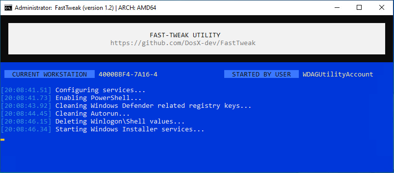

# FastTweak Utility

FastTweak is a powerful Batch program designed to enhance your computer experience by providing a quick and efficient way to disable telemetry, clean up autoload settings, logs, and other residual activities without compromising your system's functionality. This tool operates autonomously, requiring just a simple launch to get things started.

## Features 🚀

- **Telemetry Disabler**: Say goodbye to unwanted telemetry on your computer.
- **Autorun Cleanup**: Streamline your startup process by managing autoload configurations.
- **Log Cleaner**: Wipe away logs and previous activities for a cleaner system.
- **User-friendly**: FastTweak is designed for ease of use. Just run it!



## Getting Started 🏁

1. **Download**: Clone or [download](https://codeload.github.com/DosX-dev/FastTweak/zip/refs/heads/main) the FastTweak repository to your computer.

    ```batch
    git clone https://github.com/DosX-dev/FastTweak.git
    ```

2. **Run**: Execute the `FastTweak-v1.2.cmd`

3. **Enjoy**: FastTweak will automatically perform the necessary tweaks without requiring additional input.

## Disclaimer ⚠️

Use FastTweak responsibly. While it aims to enhance your computer experience, ensure you understand the changes it makes to your system. The developers are not responsible for any unintended consequences.

## Contribution 💡

FastTweak is an open-source project. Feel free to contribute by creating issues, suggesting improvements, or submitting pull requests.

## Donation 🤝
Bitcoin:
```BTC
1DosXdevPgbaRKJkAJpvf2Jmjip8zC57he
```
Litecoin:
```LTC
LUCKY777ju5Ea2VmenRuvk75kRUzTfwrHw
```

Happy tweaking! 🚀
